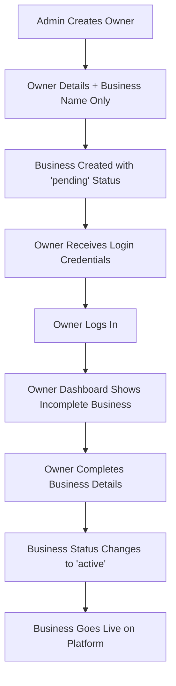

# Owner Management Workflow Architecture Plan

## Overview
This document outlines the architectural changes needed to implement a new owner management workflow where admins only create basic owner accounts with business names, and owners complete all business details themselves after logging in.

## Current System Analysis

### Current Flow
1. Admin creates owner account + complete business details in one step
2. Business is immediately active with all details
3. Complex admin forms with extensive business information

### Current Models
- **User**: Owner account information
- **Hotel/Restaurant/Transport**: Complete business data models
- **Status**: Businesses created as "active" immediately

## New Workflow Design



## Data Model Changes

### 1. Business Status Workflow
- **pending**: Created by admin, awaiting owner completion
- **active**: Completed by owner, live on platform  
- **inactive**: Temporarily disabled
- **suspended**: Administratively suspended

### 2. User Model Updates
```javascript
// Add to User schema
businessType: {
  type: String,
  enum: ['hotel', 'restaurant', 'transport'],
  required: function() { return this.role === 'owner'; }
},
hasCompletedSetup: {
  type: Boolean,
  default: false
},
setupCompletedAt: {
  type: Date,
  default: null
}
```

### 3. Business Models Updates
All business models need:
- **status**: `pending | active | inactive | suspended`
- **completionProgress**: Object tracking completed sections
- **isSetupComplete**: Boolean flag
- **adminCreatedFields**: Fields that only admin can modify

## API Architecture

### Admin Endpoints (Simplified)
```
POST /api/admin/owners/hotel
POST /api/admin/owners/restaurant  
POST /api/admin/owners/transport
```

**Request Body (Simplified):**
```json
{
  "ownerName": "John Doe",
  "ownerEmail": "john@example.com",
  "ownerPhone": "+94771234567",
  "ownerUsername": "johndoe",
  "ownerPassword": "generated_password",
  "businessName": "Sunset Hotel"
}
```

### Owner Endpoints (New)
```
GET /api/owner/business - Get owner's business details
PUT /api/owner/business - Update business details
POST /api/owner/business/complete - Mark business as complete
GET /api/owner/business/progress - Get completion progress
```

## Frontend Architecture

### Admin Components (Updated)
- **AddOwner.jsx**: Simplified form with only owner details + business name

### Owner Components (New)
- **OwnerDashboard.jsx**: Main dashboard with business completion status
- **BusinessSetup.jsx**: Step-by-step business setup wizard
- **BusinessEditor.jsx**: Full business details editor
- **SetupProgress.jsx**: Progress tracking component

## Business Completion Requirements

### Hotels
**Required Fields:**
- Name (admin-set)
- Description
- Address, City, District
- Contact phone
- At least one room type with pricing
- Check-in/out times

### Restaurants
**Required Fields:**
- Name (admin-set)
- Description
- Address, City, District
- Contact phone
- Operating hours
- At least one menu category with items
- Seating capacity

### Transport
**Required Fields:**
- Name (admin-set)
- Description
- Transport type
- Contact phone
- Service area
- At least one vehicle with pricing
- Basic policies

## Security & Authorization

### Owner Access Control
- Owners can only edit their own businesses
- Owners cannot change admin-set fields (name, owner details)
- Owners can update all business-specific details

### Admin Access Control
- Admins can view all businesses regardless of status
- Admins can override owner settings if needed
- Admins can manually change business status

## Implementation Phases

### Phase 1: Backend Updates
1. Update data models with new status fields
2. Create simplified admin endpoints
3. Create owner business management endpoints
4. Add validation for business completion

### Phase 2: Frontend Updates
1. Simplify admin AddOwner form
2. Create owner dashboard and business editor
3. Add progress tracking UI
4. Update routing and authentication

### Phase 3: Integration & Testing
1. End-to-end workflow testing
2. Data migration for existing businesses
3. User acceptance testing
4. Performance optimization

## Database Migration Strategy

For existing businesses:
- Set status to 'active' (already complete)
- Set completion flags to true
- Preserve all existing data
- Update User records with businessType

## Benefits

1. **Simplified Admin Workflow**: Admins only need basic information
2. **Owner Autonomy**: Owners have full control over their business details
3. **Better Data Quality**: Owners provide accurate, up-to-date information
4. **Scalable Process**: Easier to onboard new businesses
5. **Clear Separation**: Distinct roles and responsibilities

## Next Steps

1. Review and approve this architecture plan
2. Begin implementation with backend model updates
3. Create simplified admin endpoints
4. Develop owner dashboard and business management UI
5. Test complete workflow end-to-end